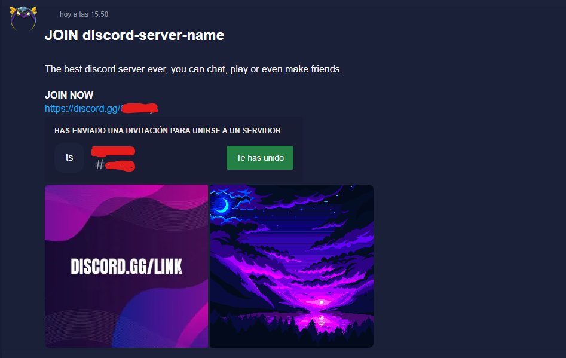

# AnnounceMate SelfBot

## Description
**AnnounceMate SelfBot** is a customizable automation bot for personal use in managing announcements and repetitive tasks on platforms like Discord. It is designed to streamline workflows and enhance productivity through easy-to-use commands and scheduling features.

---

## Table of Contents
- [AnnounceMate SelfBot](#announcemate-selfbot)
  - [Description](#description)
  - [Table of Contents](#table-of-contents)
  - [Features](#features)
  - [Installation](#installation)
  - [Usage](#usage)
    - [Example Commands:](#example-commands)
  - [Technologies Used](#technologies-used)
  - [Contributing](#contributing)
  - [License](#license)
  - [Contact](#contact)

---

## Features
- **Automated Announcements**: Schedule announcements with ease.
- **Custom Commands**: Create personalized commands for repetitive tasks.
- **User-Friendly Configuration**: Simple setup with config files.
- **Cross-Platform Compatibility**: Works on Windows, macOS, and Linux.

---

## Installation
Follow these steps to set up the project locally:

1. Clone the repository:
   ```bash
   git clone https://github.com/eduolihez/AnnounceMate_SelfBot.git
   ```
2. Navigate to the project directory:
   ```bash
   cd AnnounceMate_SelfBot
   ```
3. Install the required dependencies:
   ```bash
   pip install -r requirements.txt
   ```
4. Configure the bot by editing the `config.json` file with your preferred settings.
5. Run the bot:
   ```bash
   python main.py
   ```

---

## Usage
To use **AnnounceMate SelfBot**:

1. Ensure the bot is properly configured using the `config.json` file.
2. Start the bot by running `python main.py`.
3. Use predefined commands to manage announcements or create custom commands as per your requirements.

### Example Commands:
- **Schedule an Announcement**:
  ```
  !announce [time] [message]
  ```
- **Custom Command**:
  ```
  !custom [command_name] [action]
  ```

Here is an example of the bot in action:



---

## Technologies Used
This project utilizes the following technologies:
- **Python**: Core programming language for bot functionality.
- **Discord.py**: Library for Discord bot integration.
- **JSON**: For configuration management.
- **Asyncio**: For scheduling tasks and asynchronous operations.

---

## Contributing
Contributions are welcome! If you'd like to contribute to this project:

1. Fork the repository.
2. Create a new branch for your feature or bug fix:
   ```bash
   git checkout -b feature-name
   ```
3. Commit your changes:
   ```bash
   git commit -m "Description of changes"
   ```
4. Push the branch:
   ```bash
   git push origin feature-name
   ```
5. Open a Pull Request on GitHub.

Please ensure your contributions follow the [Contributor Covenant](https://www.contributor-covenant.org/).

---

## License
This project is licensed under the [MIT License](LICENCE). Feel free to use, modify, and distribute it as you see fit. For more details, see the LICENSE file.

---

## Contact
If you have any questions or suggestions, feel free to reach out:
- **GitHub**: [eduolihez](https://github.com/eduolihez)
- **Telegram**: [eduolihez](t.me/eduolihez)

Thank you for checking out my project! If you found it helpful, please consider giving it a ⭐ on GitHub.
